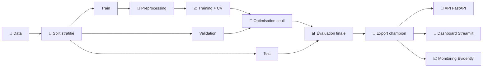

<div align="center">

 

# 🏦 Home Credit Default Risk — Scoring Crédit

 

[](https://github.com/ElyZbk/home_credit_project/actions/workflows/ci.yml)

[](https://www.python.org/)

[](https://fastapi.tiangolo.com/)

[](https://streamlit.io/)

[](https://mlflow.org/)

[](https://xgboost.readthedocs.io/)

[](https://www.evidentlyai.com/)

[](https://home-credit-project.onrender.com/)

[](LICENSE)

 

**Pipeline MLOps complet : de l'entraînement au déploiement, avec dashboard interactif et monitoring du data drift**

 

[🚀 API Démo](https://home-credit-project.onrender.com/docs) · [📊 Dataset Kaggle](https://www.kaggle.com/c/home-credit-default-risk) · [🐛 Signaler un bug](https://github.com/ElyZbk/home_credit_project/issues)

 

</div>

 

---

 

## 📋 Table des matières

 

- [ À propos](#-à-propos)

- [💼 Contexte métier](#-contexte-métier)

- [ Architecture](#-architecture)

- [ Résultats](#-résultats)

- [ Fonctionnalités](#-fonctionnalités)

  - [ Dashboard Streamlit](#-dashboard-streamlit)

  - [ Monitoring du Data Drift](#-monitoring-du-data-drift)

- [⚡ Installation](#-installation)

- [ Utilisation](#-utilisation)

  - [Lancer l'API](#lancer-lapi-en-local)

  - [Lancer le Dashboard](#lancer-le-dashboard-streamlit)

  - [Notebooks](#notebooks-dentranement-et-danalyse)

- [ API Reference](#-api-reference)

- [MLOps & Tracking](#-mlops--tracking)

- [✅ Tests & CI/CD](#-tests--cicd)

- [📁 Structure du projet](#-structure-du-projet)

- [🗺 Roadmap](#-roadmap)

- [📬 Contact](#-contact)

 

---

 

## 🎯 À propos

 

Ce projet implémente un **pipeline MLOps end-to-end** pour la prédiction du risque de défaut de crédit, avec :

- **Entraînement** optimisé sur le coût métier

- **API REST** FastAPI pour l'inférence

- **Dashboard interactif** Streamlit pour la visualisation des prédictions

- **Monitoring** du data drift avec Evidently AI

- **Déploiement** en production sur Render

 

### Fonctionnalités clés

 

| Fonctionnalité | Description |

|----------------|-------------|

| **Optimisation métier** | Seuil de décision calibré pour minimiser le coût réel (FN=10, FP=1) |

| **Pipeline robuste** | Préprocessing intégré au modèle (scikit-learn Pipeline) |

| **Tracking ML** | Expériences versionnées avec MLflow |

| **API Production** | FastAPI avec validation Pydantic + documentation auto |

| **Dashboard interactif** | Interface Streamlit avec gauge speedometer, SHAP local et comparaison clients |

| **Explicabilité SHAP** | Explication locale de chaque décision via SHAP TreeExplainer |

| **Comparaison clients** | Histogrammes acceptés vs refusés avec position du client et filtres |

| **Accessibilité WCAG** | Conformité aux critères 1.1.1, 1.4.1, 1.4.3, 1.4.4, 2.4.2 |

| **Monitoring** | Détection automatique du data drift (Evidently) |

| **Logging prédictions** | Journalisation des événements pour analyse post-déploiement |

| **CI/CD** | Tests automatisés via GitHub Actions |

| **Déploiement** | API sur Render + Dashboard sur Streamlit Cloud |

 

---

 

## 💼 Contexte métier

 

### Problématique

 

Classifier les demandes de crédit en prédisant la probabilité de défaut :

- **Classe 0** : Bon client (remboursement sans incident)

- **Classe 1** : Mauvais client (défaut de paiement)

 

### Asymétrie des coûts

 

Les erreurs de prédiction n'ont pas le même impact financier :

 

| Type d'erreur | Scénario | Conséquence | Coût |

|---------------|----------|-------------|------|

| **Faux Négatif (FN)** | Mauvais client → prédit bon | Crédit accordé → perte en capital | **10** |

| **Faux Positif (FP)** | Bon client → prédit mauvais | Crédit refusé → manque à gagner | **1** |

 

### Fonction de coût métier

 

$$\text{Coût}_{\text{métier}} = 10 \times FN + 1 \times FP$$

 

> ⚠️ **Important** : Le seuil standard de 0.5 n'est pas optimal. On recherche le seuil minimisant le coût métier sur un jeu de validation.

 

---

 

## 🏗 Architecture

 

### Pipeline de modélisation

 



 

### Prétraitement (scikit-learn Pipeline)

 

```

┌─────────────────────────────────────────────────────────────┐

│                    ColumnTransformer                        │

├────────────────────────┬────────────────────────────────────┤

│   Variables numériques │   Variables catégorielles          │

├────────────────────────┼────────────────────────────────────┤

│   • SimpleImputer      │   • SimpleImputer("MISSING")       │

│     (strategy=median)  │   • OneHotEncoder                  │

│   • StandardScaler     │     (handle_unknown="ignore")      │

└────────────────────────┴────────────────────────────────────┘

                              │

                              ▼

                    ┌─────────────────┐

                    │   XGBClassifier │

                    └─────────────────┘

```

 

### Modèles évalués

 

| Modèle | Gestion déséquilibre | Rôle |

|--------|---------------------|------|

| Logistic Regression | `class_weight` | Baseline |

| HistGradientBoosting | `class_weight` | Challenger |

| **XGBoost** | `scale_pos_weight` | **Champion** ✅ |

 

---

 

## 📊 Résultats

 

### Modèle champion : XGBoost Pipeline

 

| Métrique | Valeur |

|----------|--------|

| **Seuil optimal** | 0.54 |

| **AUC (test)** | 0.7613 |

| **Coût métier (test)** | 32 320 |

| **Recall classe 1** | 62.38% |

| **Précision classe 1** | 18.50% |

 

### Matrice de confusion (Test)

 

```

                 Prédit 0    Prédit 1

              ┌───────────┬───────────┐

Réel 0        │  TN=42898 │  FP=13640 │

              ├───────────┼───────────┤

Réel 1        │  FN=1868  │  TP=3097  │

              └───────────┴───────────┘

```

 

> 💡 **Interprétation** : Le seuil est calibré pour réduire les FN (erreur la plus coûteuse), en acceptant davantage de FP, conformément à la contrainte métier.

 

---

 

## ✨ Fonctionnalités

 

### 🎨 Dashboard Streamlit


Interface interactive pour le chargé d'étude :

- **Sélection de clients** depuis un échantillon de 10 000 clients (`clients_sample.parquet`)

- **Gauge speedometer** (demi-cercle) affichant le score de défaut avec zones verte (accepté) et rouge (refusé)

- **Explication locale SHAP** : barplot horizontal des 10 variables les plus influentes pour chaque client, avec résumé textuel des 3 facteurs principaux pour faciliter l'explication au client

- **Comparaison client** : 2 histogrammes (montant du crédit, âge) superposant la distribution des clients acceptés vs refusés, avec la position du client marquée par un trait bleu

- **Filtrage** : liste déroulante pour comparer à un sous-groupe (par genre)

- **Accessibilité WCAG** : labels textuels sur chaque zone colorée (1.4.1), contraste minimum 4.5:1 (1.4.3), tailles en rem (1.4.4), titre de page (2.4.2), alternatives textuelles sous chaque graphique (1.1.1)

- **Inspection** : payload envoyé et réponse brute de l'API

 

### 📈 Monitoring du Data Drift

 

Analyse automatique de la dérive des données avec **Evidently AI** :

- **Comparaison Train vs Test** : détection de changements statistiques

- **Rapport HTML interactif** : visualisations par feature

- **Journalisation des prédictions** : logging des événements API dans `predictions_log.parquet`

- **Alertes configurables** : squelette pour déclencher des notifications en cas de drift critique

 

---

 

## ⚡ Installation

 

### Prérequis

 

- Python 3.10+

- pip ou conda

 

### Installation locale

 

```bash

# Cloner le repository

git clone https://github.com/ElyZbk/home_credit_project.git

cd home_credit_project

 

# Créer l'environnement virtuel

python -m venv .venv

source .venv/bin/activate  # Linux/macOS

# .venv\Scripts\activate   # Windows

 

# Installer les dépendances

pip install -r requirements.txt

 

# (Optionnel) Dépendances de développement

pip install -r requirements-dev.txt

 

# (Optionnel) Dépendances d'entraînement (MLflow, Evidently, etc.)

pip install -r requirements-train.txt

```

 

---

 

## 🚀 Utilisation

 

### Lancer l'API en local

 

```bash

uvicorn src.api_app:app --reload

```

 

Accès :

- **API** : http://127.0.0.1:8000/

- **Documentation Swagger** : http://127.0.0.1:8000/docs

- **Documentation ReDoc** : http://127.0.0.1:8000/redoc

 

### Lancer le Dashboard Streamlit

 

**Prérequis** : Générer l'échantillon de clients

 

```bash

# Créer clients_sample.parquet depuis application_train.csv

python scripts/make_clients_sample.py

```

 

**Lancement** :

 

```bash

streamlit run streamlit_app.py

```

 

Le dashboard s'ouvre automatiquement dans le navigateur (par défaut : http://localhost:8501).

 

### Notebooks d'entraînement et d'analyse

 

| Notebook | Description |

|----------|-------------|

| `notebooks/01_model_training.ipynb` | Entraînement du modèle + optimisation du seuil + MLflow tracking |

| `notebooks/02_serving_and_tests.ipynb` | Tests de l'API et validation des prédictions |

| `notebooks/03_data_drift_analysis.ipynb` | Analyse du data drift avec Evidently AI + simulation monitoring |

 

### Exemple de requête API

 

```python

import requests

 

# API déployée

BASE_URL = "https://home-credit-project.onrender.com"

 

# Health check

response = requests.get(f"{BASE_URL}/health")

print(response.json())

 

# Prédiction

payload = {

    "SK_ID_CURR": 100002,

    "CODE_GENDER": "M",

    "AMT_INCOME_TOTAL": 150000,

    "AMT_CREDIT": 500000,

    # ... autres features

}

 

response = requests.post(f"{BASE_URL}/predict", json=payload)

print(response.json())

```

 

### Exemple de réponse

 

```json

{

  "status": "ok",

  "sk_id_curr": 100002,

  "probability_default": 0.8838,

  "predicted_label": 1,

  "decision": "REFUSED",

  "threshold_used": 0.54

}

```

 

---

 

## 📡 API Reference

 

### Endpoints

 

| Méthode | Endpoint | Description |

|---------|----------|-------------|

| `GET` | `/` | Informations du service |

| `GET` | `/health` | Health check (readiness probe) |

| `POST` | `/predict` | Prédiction de scoring (probabilité + décision) |

| `POST` | `/shap` | Explication locale SHAP (top 10 features + base value) |

 

### Environnements

 

| Environnement | URL |

|---------------|-----|

| **Production** | https://home-credit-project.onrender.com |

| **Documentation** | https://home-credit-project.onrender.com/docs |

| **Health** | https://home-credit-project.onrender.com/health |

 

---

 

## 📈 MLOps & Tracking

 

### MLflow

 

Le notebook d'entraînement log automatiquement :

 

- **Paramètres** : hyperparamètres, seuil, hypothèses de coût

- **Métriques** : AUC, coût métier, recall, precision, F1

- **Artefacts** : courbes ROC, coût vs seuil, matrices de confusion

- **Modèle** : pipeline complet sérialisé

 

Configuration dans `src/config.py` :

 

```python

MLFLOW_TRACKING_URI = "mlruns"  # ou URI distant

```

 

### Evidently AI

 

Monitoring du data drift avec rapport HTML interactif :

 

- **Comparaison Train vs Test** : `notebooks/03_data_drift_analysis.ipynb`

- **Rapport** : `artifacts/reports/evidently_data_drift_report.html`

- **Journalisation** : `artifacts/predictions/predictions_log.parquet`

 

### Artefacts générés

 

```

artifacts/

├── figures/

│   ├── roc_curve.png

│   ├── cost_vs_threshold.png

│   └── confusion_matrix.png

├── reports/

│   ├── evaluation_report.json

│   └── evidently_data_drift_report.html

├── predictions/

│   └── predictions_log.parquet

└── models/

    ├── champion_pipeline.joblib

    └── champion_metadata.json

```

 

---

 

## ✅ Tests & CI/CD

 

### Lancer les tests

 

```bash

# Tests unitaires

python -m pytest -q

 

# Avec couverture

python -m pytest --cov=src --cov-report=html

```

 

### GitHub Actions

 

La CI s'exécute automatiquement sur :

- Push sur `main`

- Pull requests vers `main`

 

```yaml

# .github/workflows/ci.yml

- Installation des dépendances

- Linting (optionnel)

- Exécution des tests pytest

```

 

---

 

## 📁 Structure du projet

 

```

home_credit_project/

│

├── 📂 data/

│   ├── raw/                        # Données brutes Kaggle

│   │   ├── application_train.csv

│   │   └── application_test.csv

│   └── processed/                  # Données prétraitées

│       └── clients_sample.parquet  # Échantillon pour le dashboard

│

├── 📂 artifacts/

│   ├── figures/                    # Visualisations (ROC, cost, confusion matrix)

│   ├── reports/                    # Rapports d'évaluation

│   │   ├── evaluation_report.json

│   │   └── evidently_data_drift_report.html

│   ├── predictions/                # Logs des prédictions

│   │   └── predictions_log.parquet

│   └── models/                     # Modèles sérialisés

│       ├── champion_pipeline.joblib

│       └── champion_metadata.json

│

├── 📂 notebooks/

│   ├── assets/

│   │   └── projet7_logo.svg        # Logo du projet

│   ├── 01_model_training.ipynb     # Entraînement + MLflow

│   ├── 02_serving_and_tests.ipynb  # Tests API

│   └── 03_data_drift_analysis.ipynb # Monitoring Evidently

│

├── 📂 scripts/

│   └── make_clients_sample.py      # Génération de l'échantillon clients

│

├── 📂 src/

│   ├── __init__.py

│   ├── config.py                   # Configuration globale

│   ├── inference.py                # Logique d'inférence

│   └── api_app.py                  # Application FastAPI

│

├── 📂 tests/

│   ├── fixtures/

│   │   └── sample_payload.json     # Payload de test

│   ├── test_inference.py           # Tests unitaires inférence

│   └── test_api.py                 # Tests unitaires API

│

├── 📂 .github/

│   └── workflows/

│       └── ci.yml                  # Pipeline CI/CD

│

├── streamlit_app.py                # Dashboard Streamlit

├── requirements.txt                # Dépendances production (API)

├── requirements-dev.txt            # Dépendances développement (tests)

├── requirements-train.txt          # Dépendances entraînement (MLflow, Evidently)

├── LICENSE

└── README.md

```

 

---

 

## 🗺 Roadmap

 


 

- [x] Pipeline d'entraînement end-to-end

- [x] Optimisation du seuil métier

- [x] Tracking MLflow

- [x] API FastAPI avec validation Pydantic

- [x] Tests unitaires + CI/CD GitHub Actions

- [x] Déploiement Render

- [x] **Dashboard Streamlit interactif**

- [x] **Explicabilité SHAP locale (endpoint API + visualisation dashboard)**

- [x] **Comparaison clients acceptés vs refusés (histogrammes avec filtres)**

- [x] **Gauge speedometer demi-cercle**

- [x] **Accessibilité WCAG (1.1.1, 1.4.1, 1.4.3, 1.4.4, 2.4.2)**

- [x] **Monitoring du data drift (Evidently AI)**

- [x] **Journalisation des prédictions**

- [x] **Script de génération d'échantillon clients**

- [x] **Déploiement Streamlit Cloud + Render**


---


 

---

 

<div align="center">

 

**⭐ Si ce projet vous a été utile, n'hésitez pas à lui donner une étoile !**

 

</div>

 

